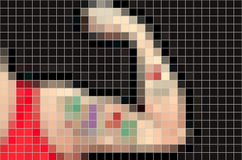
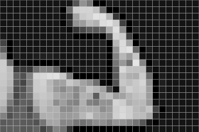

# convert_grayscale
A simple example in Verilog of how to convert an image to grayscale. 

Its main objective is to demonstrate how you can replicate hardware to reduce execution time.

You can easily test the results on [this site](https://studio.code.org/s/pixelation/stage/3/puzzle/1). It uses a small header indicating the width, height and bits per pixel, respectively. In the example below I used a 30x20 image of 24 bits per pixel:

```
1E
14
18
171313 171313 171313 ...
```

I also modified a python script from [this page](https://www.codementor.io/@isaib.cicourel/image-manipulation-in-python-du1089j1u) to check the results.

 ->  It works! 

You can [try it online here](https://www.edaplayground.com/x/NHzD)!
