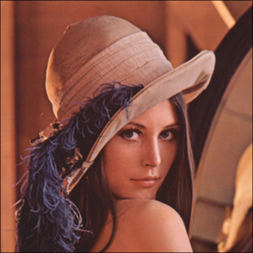
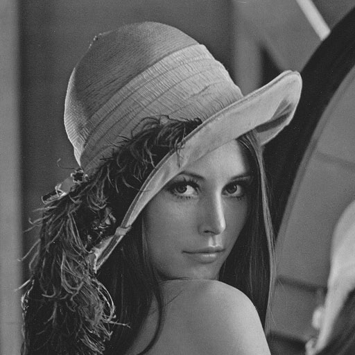
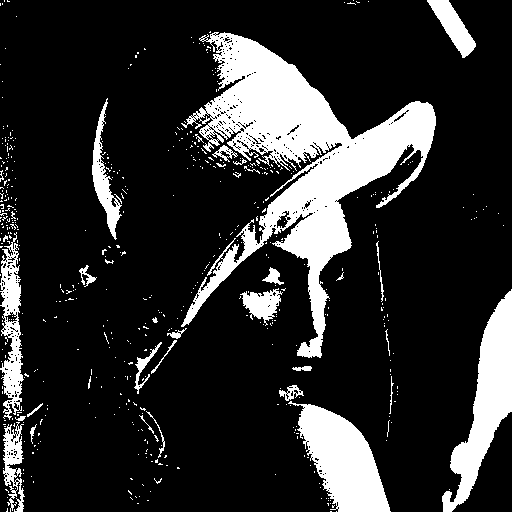
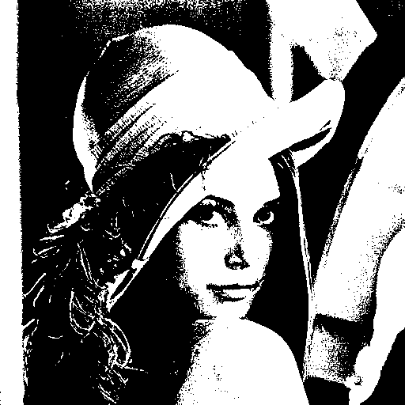
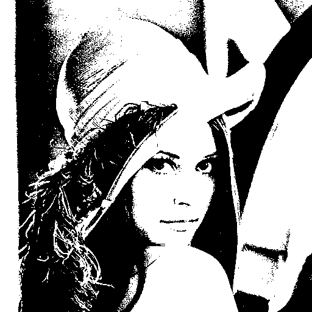
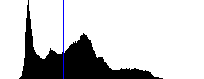

# C and ASM (generated) templates to use as software reference

Adapted algorithms from the implementation of the blur of [this site](https://abhijitnathwani.github.io/blog/2018/01/09/Blur-RGB-Image-using-C).

